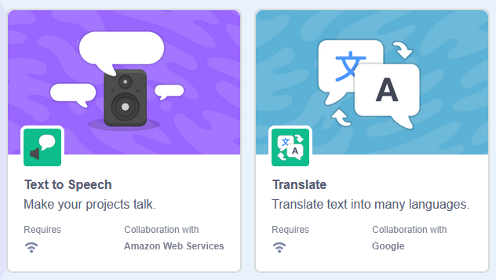
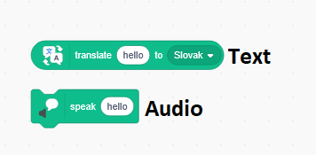

# [ScratchYouTube](https://github.com/provigz/ScratchYouTube): YouTube in Scratch!

This project makes it possible to play YouTube videos in vanilla Scratch, which:

* are up to 5-minutes long;
* are in 54p quality;
* run at around 6FPS.

https://github.com/user-attachments/assets/8ffd3e49-2cf6-4d33-a875-11f966e1da3a

## Explanation on Scratch HTTP GET requests

Scratch does not feature blocks that allow custom HTTP requests by default.

The extensions "Translate" and "Text to Speech", however, do feature blocks that make GET requests, although restricted to specific Scratch-owned endpoints.




This project takes advantage of those blocks, essentially modifying the requests they make, so that they are sent to a different server.

## Featuring

* A **Python server**, which can download videos and accepts requests for video frames and audio, compatible with Scratch.
* A **Scratch project**, which uses translation and synth blocks to make requests to the custom server.
* A **Tampermonkey userscript**, which applies the hack that makes Scratch translation and synth blocks make requests to the custom server, instead of Scratch's actual servers.
Currently directs to "localhost". Can also be copied over directly into the JS console.

Together, these 3 resources should allow for playing YouTube videos in vanilla Scratch!

Limitations:

* All frames of the video are fetched before playback. From my testing, Scratch can barely process frame data while rendering frames on the scene at the same time, which leads to slowed-down playback.
* Unless the server already has the requested video downloaded, Scratch might have to repeatedly send poll requests to detect when it becomes available, since "Translate" requests time out after 10 seconds.
* Only 5 minutes of video are allowed. This is done as to not flood the Scratch client's memory with frame data.
* Audio may not be exactly synced to the video, as we have no way of checking when it has been fetched - all of that is done internally through the "Say" block.

## Requirements (for Python server)

Install all dependencies, listed in "requirements.txt":

```
pip install -r requirements.txt
```

Ensure you have [FFmpeg](https://www.ffmpeg.org/download.html) (with FFprobe) installed on your system.
On Windows, make sure its location is added to the `PATH` environment variable, so it's accessible from anywhere on the system.

## How to run?

1. Clone or download the contents of this repository as an archive.
2. Ensure you have Python and `pip` installed. Install [all required libraries](#requirements-for-python-server) and run `server.py` afterwards.
3. Install the Tampermonkey extension in your browser and create a new userscript, where you paste in the contents of `scratch_userscript.user.js`.
Alternatively, run the code found in `scratch_userscript.user.js` inside the JS console at the Scratch editor.
4. Import `scratch_project.json` into the Scratch editor and press the green flag.

If everything is set up and working correctly, in Scratch you should be prompted to enter a video ID for the server to process, and afterwards for Scratch to play!
